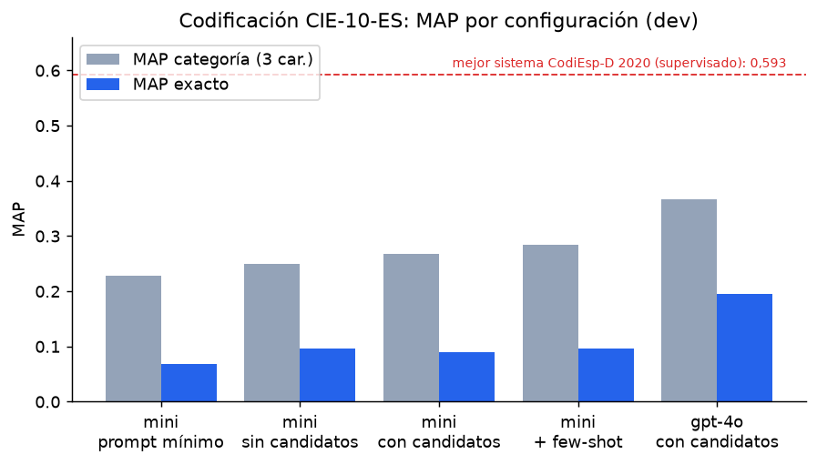
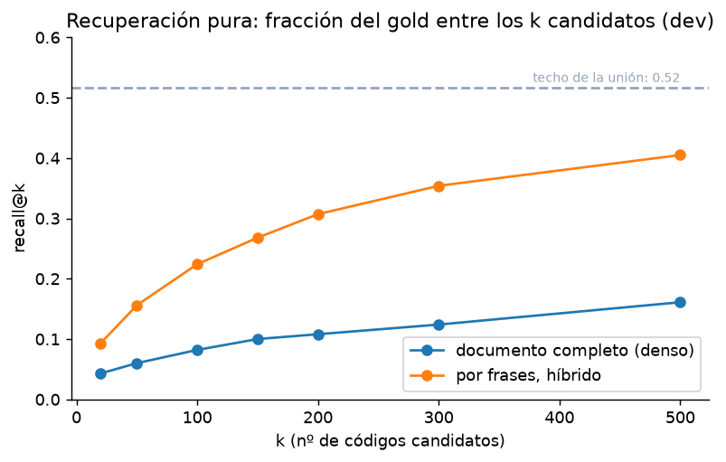
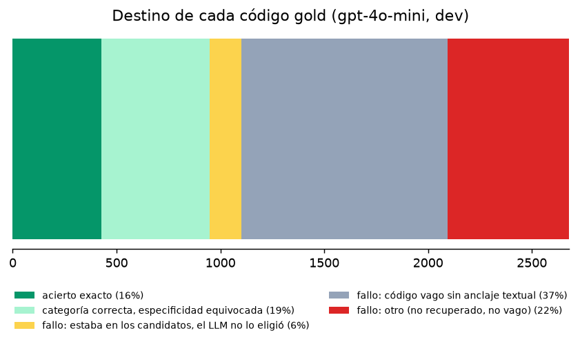
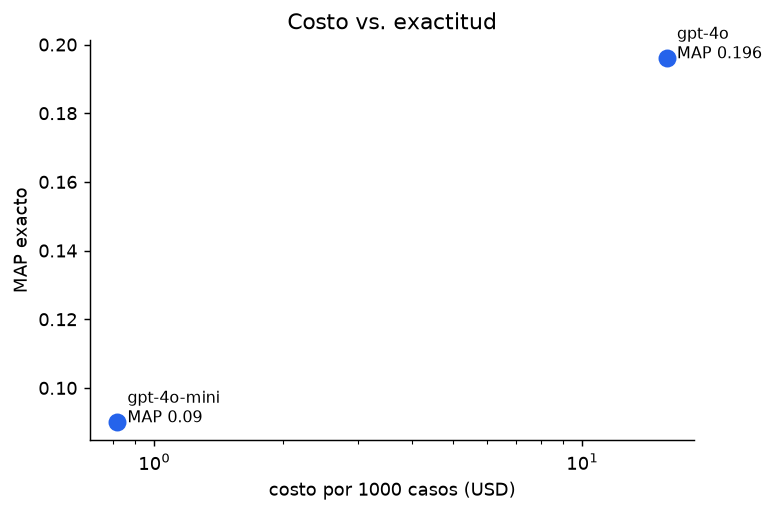

# Codificación clínica CIE-10 con recuperación + LLM: un estudio de referencia

> Estudio de benchmark sobre datos públicos (CodiEsp). No es un producto: es una
> medición honesta de qué tan lejos está un LLM moderno del estado del arte supervisado
> en codificación clínica automática en español, y de qué aporta (y qué no) añadirle
> recuperación de códigos.

Dado el texto de un caso clínico en español, el sistema propone los códigos de
diagnóstico CIE-10-ES del episodio: recupera códigos candidatos del catálogo oficial,
un LLM elige y justifica cada uno con una cita del texto, y puede además proponer
códigos que la recuperación no alcanza. Todo lo que emite el LLM se valida contra los
98.288 códigos válidos.

## El hallazgo principal

En CodiEsp-D (predecir el conjunto de códigos de diagnóstico de cada caso), el mejor
sistema del shared task de 2020, con fine-tuning supervisado, alcanzó **MAP 0,593**.

Este proyecto, sin entrenar nada:

| configuración | MAP exacto | MAP categoría (3 car.) | alucinación/caso | costo/1000 casos |
|---|---|---|---|---|
| gpt-4o-mini + recuperación (dev, 250) | 0,092 | 0,274 | 0,03 | USD 0,83 |
| gpt-4o + recuperación (dev, 50) | 0,196 | 0,366 | 0,04 | USD 15,8 |
| gpt-4o-mini + recuperación (**test, 250**) | **0,090** | **0,267** | 0,06 | USD 0,82 |

El resultado de test coincide con el de dev (0,090 vs 0,092): es estable, no está
inflado por ajuste. La distancia con el SOTA supervisado es grande y real. El valor de
este trabajo es explicar de qué está hecha esa distancia.



## De qué está hecha la distancia

**1. La recuperación tiene un techo de ~0,52.** Consultar con el caso completo fracasa
(un caso tiene ~11 diagnósticos y un solo embedding no los representa: recall@200 ≈
0,11). Partiendo el caso en frases y fusionando denso + BM25 sube a recall@200 ≈ 0,31,
pero la unión total de todos los candidatos solo cubre el **52%** del gold.



**2. Por eso la recuperación no es una lista cerrada.** El LLM puede proponer códigos
fuera de los candidatos con su propio conocimiento de CIE-10.

**3. Aun así, el 37% del gold son códigos vagos casi imposibles de acertar.** Reparto de
los 2.676 códigos gold de dev según qué hizo el sistema con cada uno:



| destino | % |
|---|---|
| acierto exacto | 16,0% |
| categoría correcta, especificidad equivocada | 19,5% |
| fallo: estaba en los candidatos y el LLM no lo eligió | 5,7% |
| fallo: código vago sin anclaje textual ("no especificado", "NEOM"...) | 37,1% |
| fallo: otro (no recuperado, no vago) | 21,8% |

El sistema **identifica bien el cuadro clínico en el 35,5%** de los casos (exacto +
categoría). El mayor modo de fallo, con diferencia, son los códigos administrativos
exhaustivos que CodiEsp exige y que no tienen anclaje en el texto.

**4. La mitad de los fallos exactos son de especificidad, no de criterio.** El MAP por
categoría de 3 caracteres casi dobla al exacto (0,27 vs 0,09): el modelo dice `N20`
(cálculo urinario) correctamente pero elige `N20.1` en vez de `N20.0`.

**5. La recuperación casi no mueve el MAP exacto, pero ancla.** Con candidatos vs. sin
candidatos el MAP exacto es casi igual (0,098 vs 0,097), pero las alucinaciones caen de
**0,39 a 0,05 códigos por caso** y la especificidad mejora (MAP categoría 0,29 vs 0,25).
Su aporte es fiabilidad, no exactitud.

**6. El prompt exhaustivo es decisivo.** Un prompt escueto hace que el modelo prediga
~6 códigos por caso (el gold tiene ~13) y el MAP cae a 0,069. Instruirlo a codificar
síntomas, consumo de tabaco/alcohol, antecedentes y variantes "no especificado" lo sube
a 0,098. El few-shot con dos ejemplos no aporta.

**7. El tamaño del modelo domina.** gpt-4o dobla el MAP de gpt-4o-mini (0,196 vs 0,092),
a ~19 veces el costo por caso.



## Metodología

- **Datos:** corpus CodiEsp (500 / 250 / 250 casos train / dev / test con gold) y la
  lista oficial de 98.288 códigos CIE-10-ES de diagnóstico. Loaders en `src/datos.py`.
- **Recuperación** (`src/recuperar.py`): el caso se parte en frases; por cada frase se
  toman los códigos más cercanos por embeddings (`text-embedding-3-small`, dim 512) y
  por BM25 (matriz término-documento dispersa en scipy); las listas se fusionan con RRF.
  Expansión de abreviaturas clínicas frecuentes (HTA, DM2, ITU...).
- **Codificador** (`src/codificador.py`): el LLM recibe el caso y ~150 candidatos con su
  descripción y devuelve JSON estructurado (código + evidencia textual). Validación
  contra el catálogo, resolución de códigos escritos sin punto, reintentos ante límite
  de tasa y rescate de JSON truncado.
- **Evaluación** (`src/eval_codificador.py`): MAP (métrica oficial de CodiEsp-D), P/R/F1
  micro exacto y por categoría de 3 caracteres, tasa de alucinación, costo y latencia.
  Ablations: con/sin candidatos, prompt exhaustivo/mínimo, zero/few-shot, mini/4o.
- **Análisis de errores** (`src/analisis_errores.py`): clasifica cada código gold y cada
  código predicho por tipo de acierto o fallo.

## Limitaciones

- CodiEsp-D es dato clínico de España (CIE-10-ES ≈ ICD-10-CM). El sistema de Chile usa
  CIE-10 OMS para diagnósticos y CIE-9-MC para procedimientos: la arquitectura se reusa
  cambiando el catálogo indexado y el prompt, no el pipeline.
- No se distingue diagnóstico principal de secundarios: el gold de CodiEsp-D no lo
  etiqueta.
- La lista oficial de códigos no trae notas de inclusión/exclusión ni jerarquía, que
  ayudarían a la recuperación.
- La tajada de gpt-4o son 50 casos de dev; su intervalo de confianza es ancho.
- **El gold tiene decisiones defendibles de varias formas.** Lo anotaron humanos y hay
  desacuerdo entre anotadores. Ejemplo (caso `S0004-06142005000900016-1`): mujer de 29
  años con estenosis de la unión pieloureteral causada por un hemangioma cavernoso; el
  gold la codifica como `Q62.11` (oclusión *congénita*) y añade `N20.0` (cálculo) pese a
  que el texto dice "no antecedentes de nefrolitiasis" y la anatomía patológica encontró
  un hemangioma, no un cálculo. Parte de lo que se cuenta como error del LLM son casos
  así, donde su elección es tan defendible como la del gold. Por eso la coincidencia por
  categoría de 3 caracteres es una lente más justa que la exacta.
- **Las convenciones de codificación de CodiEsp no son las de Chile.** CodiEsp sigue
  ICD-10-CM: un solo código por neoplasia (sin morfología CIE-O aparte), no se codifican
  hallazgos del capítulo R cuando hay diagnóstico conocido, y los códigos son de 5-7
  caracteres. El GRD chileno usa CIE-10 OMS (3-4 caracteres) + morfología CIE-O + CIE-9-MC
  para procedimientos.

## Herramientas

Python, pandas, numpy, scikit-learn, scipy (BM25 disperso), OpenAI API (LLM y
embeddings), matplotlib.

## Cómo reproducir

```bash
python3 -m venv .venv && source .venv/bin/activate
pip install -r requirements.txt
cp .env.example .env          # y completar OPENAI_API_KEY

python src/descargar_datos.py                         # corpus + códigos en data/codiesp/
python src/indice.py                                  # embeddings del catálogo (~USD 0,06)
python src/eval_retrieval.py --split dev
python src/eval_codificador.py --split dev --n 250
python src/eval_codificador.py --split test --n 250
python src/analisis_errores.py --config gpt-4o-mini_concand --split dev --n 250
python src/figuras.py
```

## Fuentes de datos

- **CodiEsp corpus** (CLEF eHealth 2020), Barcelona Supercomputing Center. Zenodo
  3837305, CC-BY 4.0.
- **CodiEsp code list** (CIE-10-ES 2018). Zenodo 3706838, CC-BY 4.0.
